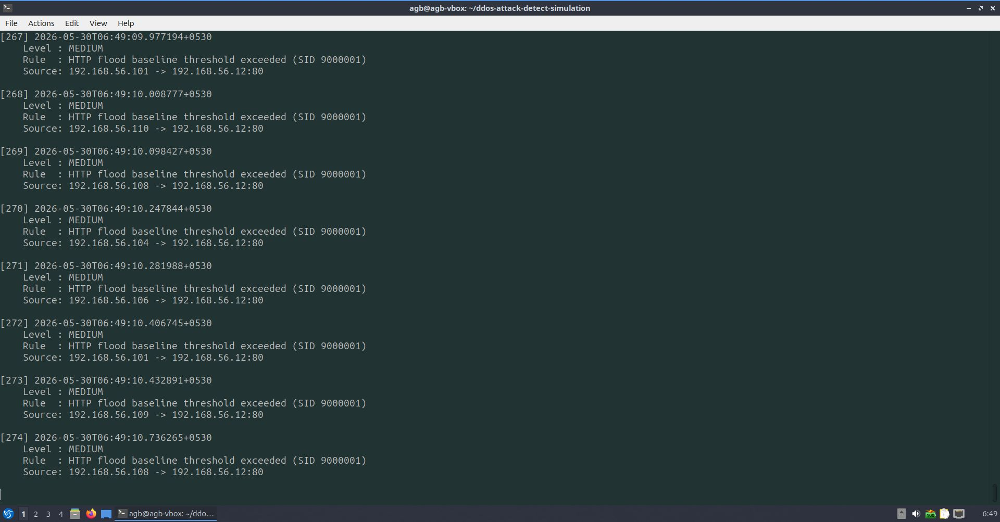
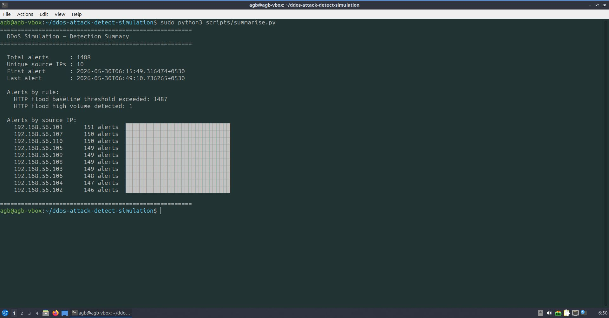

# DDoS Attack Detection Simulation

A home lab I built to understand how distributed HTTP flood attacks work
and how Suricata IDS detects them in real time.

Ten Docker containers on a Kali Linux VM act as independent attackers,
each with a unique IP address. A Lubuntu VM runs Apache2 as the target
and Suricata IDS as the detector. Two Python scripts monitor and
summarise the alerts.

## Architecture
Kali Linux (192.168.56.40)
└── Docker macvlan network (attacker_net)
├── attacker1  — 192.168.56.101
├── attacker2  — 192.168.56.102
├── ...
└── attacker10 — 192.168.56.110
│
│  HTTP flood (ab — ApacheBench)
▼
Lubuntu VM (192.168.56.12)
├── Apache2 — target web server on port 80
└── Suricata 7.0.3 — monitoring interface enp0s8
├── ET Open ruleset (50,000+ community rules)
└── custom-ddos.rules — two custom detection rules
## Lab Components

| Component | Role |
|---|---|
| Docker macvlan | Gives each container a unique IP on the network |
| ApacheBench (ab) | Generates HTTP flood traffic from each container |
| Apache2 | Target web server receiving the flood |
| Suricata IDS | Detects the attack using custom rules |
| watch.py | Monitors eve.json and prints alerts in real time |
| summarise.py | Reads eve.json after attack and summarises detections |

## Custom Detection Rules

Two rules written in local.rules:

**Rule 9000001 — Baseline threshold**
Fires when one source IP sends more than 100 HTTP requests in 10
seconds. Flags automated traffic that no human could generate manually.

**Rule 9000002 — Flood threshold**
Fires when one source IP sends more than 500 HTTP requests in 5
seconds. Indicates an active deliberate flood.

Both rules use `track by_src` which means each attacking IP is counted
independently — critical for detecting distributed attacks correctly.

## Results

Both rules fired successfully across all 10 attacking containers.
Suricata correctly identified each container as a separate source.

## Setup

See individual setup docs in the `victim/` folder for step by step
Suricata and Apache2 configuration.

Attacker setup requires Docker with a macvlan network on the
192.168.56.0/24 subnet.
